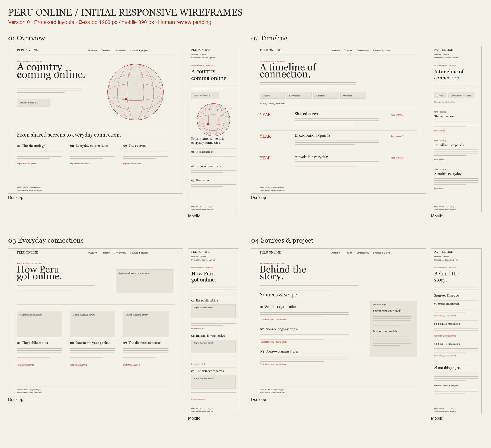

# Perú Online: CM1040 Coursework 2 report

Niels Pacheco · September 2026

AI-assisted draft: student review, personal reflections, human feedback and laboratory-engine confirmation remain necessary.

## A. Background research

Perú Online examines access in Peru from 1997, my birth year, through 2025, connecting cabinas, broadband/mobile networks and inequality. It neither dates Peru's first connection to 1997 nor invents memories.

IDB describes cabinas públicas offering shared computers and hourly rental [1]; Telefónica documents Speedy accesses [2]. MTC records distinguish spectrum awards from commercial service and document backbone deployment. Ten milestones link to eleven sources with publication/access dates and supported claims.

Company reports describe their own services, so operator claims are explicitly attributed; official survey estimates provide a separate population measure for the geographic access comparison.

Operator accesses and individual use differ from household service. The chart compares INEI's preliminary Q4 2025 household estimates: national 60.1%, metropolitan Lima 78.2%, other urban 63.1%, rural 23.4% [3]. Lima includes Callao. The rounded 54.8-percentage-point Lima–rural gap does not measure speed or affordability.

## B. Planning

Four consistently linked pages guide general readers: Overview introduces the narrative; Timeline provides searchable chronology; Connections explains access/inequality; Sources supplies references, definitions and credits.

MoSCoW priorities make responsive pages, sourced research, JSON templating/validation, testing, authentic feedback and ZIP/PDF delivery essential. Animation is secondary; accounts/live statistics are excluded. Chosen techniques require checking against module terminology.

Milestones progress through research, structure, prototypes, feedback, implementation, verification and delivery. `docs/plan.md` records dependencies and acceptance criteria. The feedback gate remains open, distinguishing a working website from completed coursework.

## C. Development process: prototype designs

Wireframes cover all four pages on desktop/mobile. Desktop uses columns and a sources sidebar; mobile stacks content with visible navigation. PNGs preserve proposals; screenshots document implementation.

Dribbble concepts inspired spacious compositions and sculptural motion [4]. Paper colours, dark text and red accents establish an editorial identity. Original AI-assisted procedural illustrations are not historical evidence or accurate network maps. Credits identify inspiration/font licences.

Browser inspection revealed globe overflow; constraining the canvas corrected it. Remaining 320-pixel navigation overflow required smaller padding. Opaque backgrounds strengthened globe-label contrast. These were implementation reviews, not participant feedback.

No other person has reviewed the prototypes. `docs/feedback.md` provides tasks/forms for actual dated comments, resulting changes and follow-up evidence. Automated checks cannot satisfy this assessed requirement.

## D. Development process: developing the code

HTML, CSS, JavaScript and JSON are separate. Semantic landmarks/headings organise content; CSS Grid, flexible sizing and media queries adapt layouts. Assets are local.

After HTTP fetch, `validateData` checks collections, fields, types, text, unique safe IDs, years 1997–2025, finite percentages 0–100, HTTPS URLs and citation references. Syntax-valid JSON can violate these rules; failures produce readable messages.

The custom engine substitutes escaped `{{field}}` tokens into templates. Text/attribute escaping complements URL/numeric validation; missing/nonprimitive fields fail. This matches Topic 6's library-free JavaScript template-engine objective [5], but the exact laboratory engine remains unconfirmed.

Timeline filters/accent-normalised search expose states, announce counts and explain empty results. Motion supports pausing/reduced-motion preferences. Relative paths support HTTP serving and GitHub Pages, verified after its successful 21:07:15Z build: https://nielspac177.github.io/peru-online/.

## E. Testing: validation reports and actions taken

The preserved baseline records ten html-validate lint findings: seven source style edits and three documented accommodations for template IDs/chart widths, not ten functional defects. A formatter regression was also recorded and corrected. Final checks cover five pages, including 404, as source and rendered documents: zero HTML errors/warnings.

All 64 tests passed, covering schema rejection, boundaries, citations, injection escaping, missing fields and packaged links/assets. jsdom axe reported zero structural violations; contrast was excluded because jsdom lacks a rendering engine.

A real-browser axe run covered four pages with contrast enabled: zero violations, two incomplete contrast rules. CSS inspection/luminance calculations reviewed uncertain labels and symbols; solid backgrounds were strengthened. Recorded colour pairs range from 4.84:1 to 13.39:1. This targeted review does not establish complete WCAG conformance.

All four pages passed actual viewport checks at 320, 390, 768 and 1280 pixels without horizontal scrolling after fixes. Screen-reader testing remains unperformed. Reports, limitations and screenshots are in `evidence/`.

## F. Reflections on learning

Statistics mislead when populations differ; escaped templates require schema/URL checks; automated passes leave usability questions unanswered. Participant review remains substantive work. The student must understand and explain these choices independently.

## References

[1] IDB. *Internet for the people*. November 1997.

[2] Telefónica del Perú. *2002 Annual Report*. SEC, 2003.

[3] INEI. *TIC en los hogares: IV Trimestre 2025*. 2026, pp. 6–7.

[4] Alex Bender/FANCY. Dribbble concepts 26305597 and 26270031.

[5] University of London. *CM1040 Web Development 2025*, Topic 6, p. 4.

Full source URLs/access dates: Sources page and `data/content.json`.
